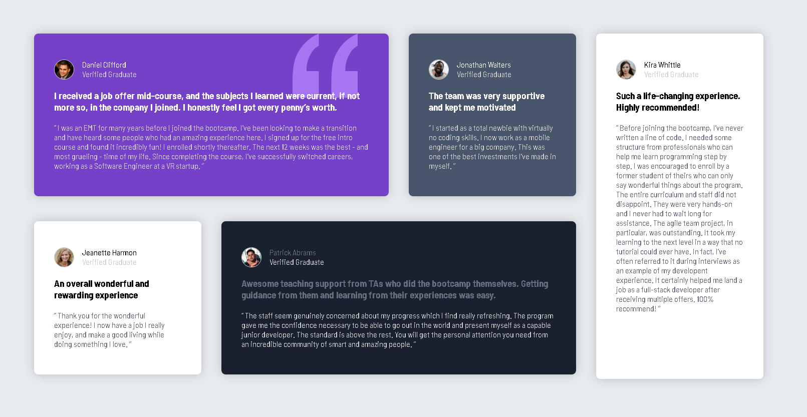

# Frontend Mentor - Testimonials grid section solution

This is a solution to the [Testimonials grid section challenge on Frontend Mentor](https://www.frontendmentor.io/challenges/testimonials-grid-section-Nnw6J7Un7). 

### The challenge

Users should be able to:

- View the optimal layout for the site depending on their device's screen size

### Screenshot

- Solution URL: [solution URL ](https://www.frontendmentor.io/solutions/5-card-grid-and-flexbox-testimonal-section-lAtRTWbRoI)
- Live Site URL: [ live site URL](https://testimonials-grid-section-main-five-eta.vercel.app/)

## My process

### Built with

- Semantic HTML5 markup
- CSS custom properties
- Flexbox
- CSS Grid
- Mobile-first workflow

## Author
Name: Purvesh patil
University : RMIT Mel, Aus
